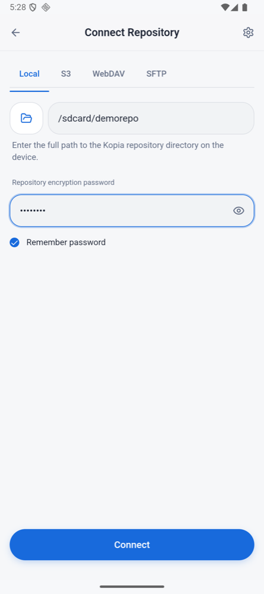
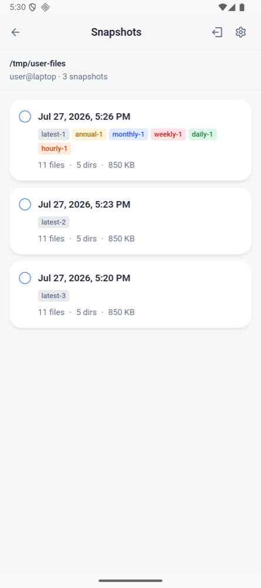
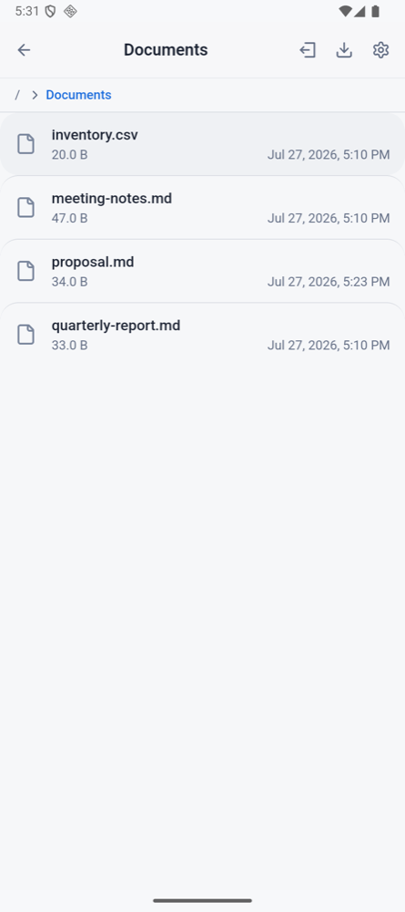
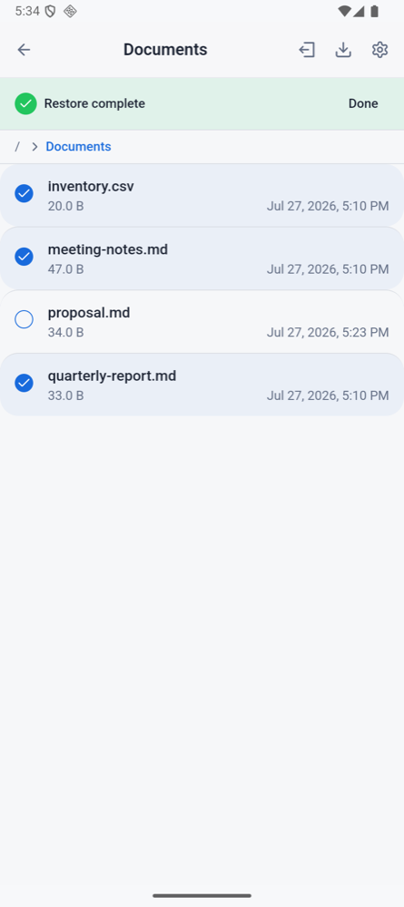

# KopiaKt

Native Kotlin implementation of [Kopia](https://github.com/kopia/kopia) for Android.

> **Disclaimer:** KopiaKt is an independent project and is **not affiliated with,
> sponsored by, or endorsed by** the [Kopia](https://github.com/kopia/kopia)
> project. The name "Kopia" is used only to describe repository-format compatibility.

## Why

I use Kopia on desktop to back up my machines. When I needed to access and restore those snapshots on Android, there was no solution available. Running the Go binary on Android had too many limitations, so I decided to implement the Kopia repository format natively in Kotlin.

KopiaKt can open and read repositories created by the original Go implementation. Connect to your existing Kopia repository from your phone, browse snapshots, restore files directly to the device — and back the phone up into that same repository, as a normal Kopia snapshot your desktop can restore.

## Screenshots

| Connect | Snapshots | Browse | Restore |
|---|---|---|---|
|  |  |  |  |
| Local, S3, WebDAV or SFTP | Retention reasons per snapshot | Directory tree of a snapshot | Multi-select and restore |

## Status

KopiaKt reads, restores, and backs up — **on demand, while the app is running**. Concretely:

| Capability | State |
|---|---|
| Connect to an existing Kopia repository | Works |
| Browse snapshots and directory trees | Works |
| Restore files and directories to the device | Works |
| Create a new (empty) repository | Works |
| Edit retention / compression / ignore-rule policies | Works |
| **Run a backup from the phone** | **Works**, on demand — see [Divergences](#divergences-from-desktop-kopia) |
| Apply retention after a backup | Works — deletes snapshot manifests only, never contents |
| Automatic / scheduled backups | **Not implemented.** The schedule UI writes a policy nothing on the phone acts on |
| Repository maintenance / garbage collection | Not run on the phone; use desktop Kopia |

You start a backup yourself; it holds a foreground-service notification for as long as it runs. What
it writes is a normal Kopia snapshot: the test suite has desktop Go Kopia restore a phone-written
snapshot pulled off the device and compare it byte for byte against the original.

**An interrupted backup does not resume.** The run lives in the app's own process — closing the UI is
fine, the notification keeps it going — but if that process is stopped, by the system reclaiming
memory or by the phone's own app-killing, the backup ends there. Start it again and it will be cheap:
everything already uploaded is deduplicated, so the retry re-uses it instead of re-uploading.

Treat this as a companion to a desktop Kopia install, not a replacement for it — the phone still
depends on the desktop for maintenance.

## Divergences from desktop Kopia

These are deliberate behavioural differences, not bugs. They do not affect repository-format
compatibility — see [Compatibility](#compatibility).

| Divergence | What it means for you |
|---|---|
| **Backups run only while the app is running and connected.** Starting one with no repository open is refused, and disconnecting cancels pending work. | A backup makes progress only while the app's process is alive — no scheduled or background work picks it up later. It does not resume by itself; you start it again, and deduplication makes the retry cheap. |
| **The phone never runs repository maintenance.** Desktop Kopia auto-runs maintenance — including garbage collection with deletion — after a snapshot when it owns the repository. KopiaKt never does. | Retention on the phone deletes snapshot *manifests*, never *contents*, and an interrupted run leaves orphaned packs behind. **Run maintenance from desktop Kopia periodically, or repository storage grows.** |
| **One effective policy per source**, merged source → user → host → global. Desktop Kopia resolves a policy *tree*: a policy set on a parent path applies to sources beneath it, and per-subdirectory policies can change the rules partway through a directory walk. | A policy you set on a parent path from the desktop does not reach a phone source underneath it, and a per-subdirectory policy is ignored. Set the policy on the source itself. |
| **Scheduled backups are not implemented.** The policy editor's *Schedule* tab and the add-source wizard still write a scheduling policy, but nothing on the phone reads it. | Every backup on the phone is one you start by hand. |

## Usage

1. **Connect.** On the welcome screen choose *Connect to Repository*, pick the storage type, and fill
   in its details — an S3 bucket and endpoint, a WebDAV URL, an SFTP host and path, or a local
   directory. Failures are reported specifically (bad credentials, untrusted host key, unreachable
   endpoint) rather than as a generic error. *Create New Repository* additionally offers a
   *Test Connection* step before the repository is written.
2. **Trust material, if needed.** For SFTP, paste a `known_hosts` line or a host-key fingerprint —
   connections without either are refused. For a self-signed HTTPS server, supply the certificate
   fingerprint (WebDAV) or root CA (S3). If you must use `http://`, you have to tick the cleartext
   acknowledgement explicitly.
3. **Unlock.** Enter the repository password. It is derived with scrypt and can be stored in
   Android's encrypted preferences so you do not retype it.
4. **Browse.** Snapshots are grouped by source. Open one to walk its directory tree.
5. **Restore.** Select files or directories, choose a destination folder through the system picker,
   and confirm. Progress is reported per file, and the restore can be cancelled.
6. **Back up.** Add a source — a folder picked with the system picker, or a path under shared
   storage — and optionally set its policy. Then pick *Back Up Now* from that source's menu on the
   dashboard. A notification shows progress and offers *Cancel*. The snapshot is written under the
   phone's own source identity, and the source's retention policy is applied as soon as it is saved.

## Features

- Byte-level Kopia repository-format compatibility for **read, restore and backup** — see [Compatibility](#compatibility)
- Back up folders from the phone into a repository shared with desktop Kopia, with the source's
  effective policy (ignore rules, compression, retention) applied
- Connect over S3, WebDAV, SFTP, local filesystem, or Android SAF
- Browse snapshot directory trees; restore files and directories to device storage
- AES-256-GCM-HMAC-SHA256 content encryption; scrypt (or PBKDF2) password derivation, HKDF for content keys
- Content hashing: BLAKE2B-256-128, BLAKE2B-256-256, BLAKE3-256, HMAC-SHA256, HMAC-SHA256-128
- Compression: Zstd, LZ4, Gzip, Deflate, PGZIP
- Pack index: reads V1 and V2, writes V1
- Index blob naming compatible with Kopia's epoch mode (repository format versions 2 and 3)

### Security posture

Because this is a backup tool holding credentials, a few defaults are deliberately stricter than the
Go implementation:

- **SFTP host-key verification fails closed.** A connection with no `known_hosts`, pinned
  fingerprint, or explicit opt-in is refused rather than trusted. The insecure opt-in is rejected
  outright in release builds.
- **Self-signed / private-CA HTTPS is supported** via a pinned certificate fingerprint (WebDAV) or a
  custom root CA (S3). Pinning matches the **leaf certificate only** — Kopia's Go implementation
  accepts a match against any certificate in the presented chain, which a hostile server can satisfy
  by appending the victim's (public) pinned certificate.
- **`doNotVerifyTls` is not supported**, by design.
- **Cleartext HTTP requires an explicit per-connection acknowledgement** before credentials are sent,
  and TLS trust material combined with an `http://` endpoint is rejected rather than silently ignored.

## Architecture

```
.
├── core/         # Repository format: blob, content, encryption, compression, pack, index
├── snapshot/     # Snapshots: upload, restore, policy, maintenance
├── storage/      # Storage backends: S3, WebDAV, SFTP, filesystem, TLS trust
├── android/      # Android platform: workers, notifications, SAF storage
├── app-android/  # Android app (WebView + JavaScript bridge)
├── react-ui/     # React frontend served via WebView
├── e2e/          # Maestro UI flows + JVM cross-compatibility tests
├── sync-tools/   # Go helpers for tracking upstream Kopia
└── testvectors/  # Fixtures generated by Go Kopia
```

The app renders a React frontend in a WebView and talks to the Kotlin backend over a JavaScript
bridge. The WebView is served from a virtual HTTPS origin via `WebViewAssetLoader` with file and
universal access disabled, navigation confined to the bundled document, and a strict CSP.

## Requirements

- Android 8.0+ (API 26)
- JDK 21 (the `core`/`snapshot`/`storage` modules use a JDK 21 toolchain; Gradle can provision it)
- Node.js — the React UI is built during the Android build and is not committed

## Build

```bash
./gradlew :app-android:assembleDebug
./gradlew :app-android:installDebug
```

## Test

```bash
# Unit tests
./gradlew test

# Lint gate
./gradlew detekt ktlintCheck

# Storage backend integration tests (Testcontainers; needs Docker)
./gradlew :storage:integrationTest

# JVM cross-compatibility against the real Go binary (needs `kopia` on PATH or $KOPIA_BINARY)
./gradlew :e2e:test -Pe2e

# E2E tests (Maestro UI flows; require a running AVD)
bash e2e/maestro/scripts/manage_avds.sh create 1
bash e2e/maestro/scripts/manage_avds.sh start 1
# run_e2e.sh builds a fresh APK, configures the device, pushes test repos, and runs each
# flow with state reset + failure artifacts (prefer it over raw `maestro test`):
bash e2e/maestro/scripts/run_e2e.sh emulator-5554
# Remote-backend flows (S3/WebDAV/SFTP) also need Docker:
#   bash e2e/maestro/scripts/start_storage_backends.sh && bash e2e/maestro/scripts/seed_storage_backends.sh
```

Suites that need external credentials or a LAN host (`e2e/b2/`, `e2e/homelab/`) skip themselves
unless configured; see the README in each directory.

## Storage Backends

| Backend | Status | Notes |
|---------|--------|-------|
| S3 | Working | MinIO, AWS, Backblaze B2, any S3-compatible; optional custom root CA |
| WebDAV | Working | Custom OkHttp-based client; optional certificate-fingerprint pinning |
| SFTP | Working | sshj + BouncyCastle; host-key verification fails closed |
| Filesystem | Working | Direct file I/O |
| SAF | Working | Android scoped storage |

## Compatibility

Verified against repositories, fixtures, and test vectors produced by the Go implementation:

- **Encryption** — AES-256-GCM-HMAC-SHA256 ciphertext and key derivation
- **Hashing** — BLAKE2B-256-128, BLAKE3-256, HMAC-SHA256 (Go-generated vectors)
- **Compression** — Zstd, LZ4, Gzip, Deflate and PGZIP content written by Go
- **Pack format** — pack blobs and their embedded (encrypted) local index; pack index V1 and V2 parsing
- **Index blobs** — epoch-mode blob naming, so Go sees index blobs written by Kotlin
- **Round trip** — Kotlin writing into a Go-created repository, and Go reading the result
- **On a device** — a snapshot backed up from an Android emulator into a repository the Go binary
  created, then pulled off the device, restored by that binary, and compared byte for byte against
  the original tree

Content encryption uses a random nonce, so byte-identical output is not achievable in either
direction (the same is true of Go). The contract that is tested is **mutual readability**, not
identical bytes.

Known gaps:

- **S2 compression is not supported.** It is a Go-specific algorithm; content compressed with it
  cannot be read. Kopia does not use S2 by default.
- **ChaCha20-Poly1305 is not implemented**; only AES-256-GCM-HMAC-SHA256 and `NONE` are offered.
- Epoch index **advancement and compaction** are not implemented. Go's maintenance handles them on a
  shared repository; a Kotlin-only repository accumulates uncompacted index blobs, which costs
  listing time but not correctness.

## Contributing

See [`CONTRIBUTING.md`](CONTRIBUTING.md). Security issues: [`SECURITY.md`](SECURITY.md).

## License

KopiaKt is licensed under the [Apache License 2.0](LICENSE) — the same license as
upstream Kopia. See [`NOTICE`](NOTICE) for attribution and
[`THIRD_PARTY_NOTICES.md`](THIRD_PARTY_NOTICES.md) for third-party code (the
rolling-hash splitters are ports of `chmduquesne/rollinghash`, MIT/BSD-2).

KopiaKt is not affiliated with or endorsed by the
[Kopia](https://github.com/kopia/kopia) project.
